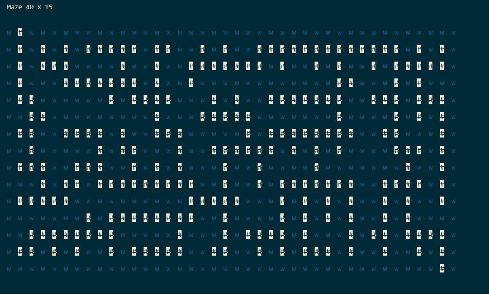

# MazeGenerator
## General Info 
This project was created as my first step in learning Python, inspired by the ["Fun with Python"](https://ozekai9.medium.com/fun-with-python-series-5ab2ab4da515) series. The programm allows to generate random mazes of a command-line given size with [Randomized Prim's Algorithm](https://en.wikipedia.org/wiki/Maze_generation_algorithm).
## Example of use
Printing out a maze:
